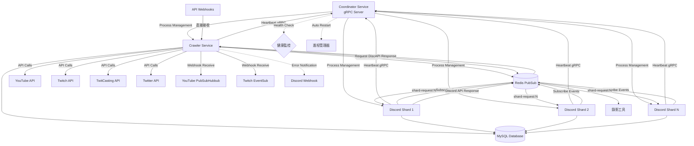

# Discord Stream Notify Bot 棕地架構文件

## 引言

本文件記錄 **Discord Stream Notify Bot** 的現有系統狀態，包括技術債務、架構限制和現實中的實作模式。此文件作為前後端分離和 shard 架構現代化的基礎參考。

### 文件範圍
專注於**Coordinator-Shard 架構轉換**相關領域：
- Discord Bot Shard 實例（按 Discord 建議的分片數量分配）
- Coordinator 服務（Shard 生命週期管理和健康檢查）
- gRPC 為基礎的 Shard 協調機制
- 爬蟲系統工作分配（非 Guild 分配）

### 變更日誌

| 日期 | 版本 | 描述 | 作者 |
|------|------|------|------|
| 2025/08/18 | 1.0 | 初始棕地架構分析 | BMad Architect |
| 2025/08/18 | 1.1 | 新增 Docker 容器化架構設計 | Scrum Master |

## 快速參考 - 關鍵文件和進入點

### 關鍵文件以理解系統

- **主要進入點**: `Program.cs` - 支援 shard 啟動參數
- **Bot 核心**: `Bot.cs` - Discord 客戶端和服務初始化
- **配置管理**: `BotConfig.cs` - 所有外部服務配置
- **資料庫上下文**: `DataBase/MainDbContext.cs` - EF Core 配置
- **Redis 連線**: `RedisConnection.cs` - 單例模式連線管理

### Discord 互動層（各 Shard 實例）
- **斜線指令**: `Interaction/InteractionHandler.cs`
- **傳統指令**: `Command/CommandHandler.cs`
- **指令模組**: `Interaction/` 和 `Command/` 目錄下的各平台模組

### 業務邏輯層（共享於各 Shard）
- **共享服務**: `SharedService/` - 各平台爬蟲和通知邏輯
- **YouTube 服務**: `SharedService/Youtube/YoutubeStreamService.cs`
- **其他平台**: `SharedService/Twitch/`, `SharedService/Twitter/`, `SharedService/Twitcasting/`

### Shard 協調影響區域（獨立爬蟲專案模式）

**Crawler 服務（獨立專案）**：
- **專責爬蟲邏輯**：執行所有平台的直播狀態檢測
- **狀態變化廣播**：透過 Redis PubSub 通知所有 Discord Shard
- **追蹤管理**：監聽 follow/unfollow 事件，動態調整爬蟲目標
- **定期維護**：清理失效追蹤、API 配額管理、錯誤恢復

**Discord Shard 實例（純 Bot 功能）**：
- **通知處理**：監聽 Redis PubSub 事件發送 Discord 通知
- **指令處理**：處理 Discord 使用者互動和管理指令
- **Guild 管理**：根據本 Shard 分片處理對應 Guild

**Coordinator 服務（統一管理）**：
- **多服務管理**：同時管理 Crawler 服務和 Discord Shard 進程
- **健康檢查**：監控 Crawler 和各 Shard 的運行狀態
- **進程協調**：處理服務間依賴關係和啟動順序
- **gRPC API**：提供統一的管理接口

## 高層架構

### 技術概要

**當前架構**：單體應用程式 + Redis 快取 + 外部錄影工具整合

### 實際技術堆疊

| 類別 | 技術 | 版本 | 備註 |
|------|------|------|------|
| 執行環境 | .NET | 8.0 | 已從 6.0 升級 |
| 框架 | Discord.Net | 3.17.2 | Discord API 客戶端 |
| 資料庫 | MySQL | - | 使用 Pomelo EF Core 驅動 |
| 快取 | Redis | - | 用於 PubSub 和狀態管理 |
| ORM | Entity Framework Core | 9.0.3 | 程式碼優先模式 |
| HTTP 客戶端 | IHttpClientFactory | - | 使用 Polly 重試策略 |
| YouTube API | Google.Apis.YouTube.v3 | 1.69.0.3707 | OAuth2 會限驗證 |

### 儲存庫結構現實檢查

- **類型**: 單儲存庫 (Monorepo)
- **包管理器**: NuGet (.csproj)
- **特殊性**: 多組態支援（Debug, Release, Debug_API, Debug_DontRegisterCommand）

## 原始碼樹狀結構和模組組織

### 專案結構（實際）

```text
DiscordStreamNotifyBot/
├── Program.cs                    # 主進入點，支援 shard 參數
├── Bot.cs                        # Discord 客戶端初始化和服務註冊
├── BotConfig.cs                  # 組態管理（JSON 檔案讀取）
├── RedisConnection.cs            # Redis 連線單例模式
├── Utility.cs                    # 全域工具類別
├── Auth/                         # JWT Token 加密管理
│   ├── TokenCrypto.cs
│   └── TokenManager.cs
├── Command/                      # 傳統 Discord 指令 (s! prefix)
│   ├── CommandHandler.cs
│   ├── Admin/, Help/, Normal/    # 指令分組
│   └── [Platform]/*.cs           # 各平台指令
├── Interaction/                  # 斜線指令 (Discord Slash Commands)
│   ├── InteractionHandler.cs
│   ├── Help/, OwnerOnly/         # 指令分組
│   └── [Platform]/*.cs           # 各平台互動指令
├── SharedService/                # 業務邏輯核心 (未來後端)
│   ├── EmojiService.cs
│   ├── Youtube/                  # YouTube 直播監控
│   ├── Twitch/                   # Twitch 直播監控
│   ├── Twitter/                  # Twitter Spaces 監控
│   ├── Twitcasting/              # TwitCasting 監控
│   └── YoutubeMember/            # YouTube 會限驗證
├── DataBase/                     # 資料存取層
│   ├── MainDbContext.cs          # EF Core DbContext
│   ├── MainDbService.cs          # 資料庫服務包裝
│   └── Table/                    # 實體模型
├── HttpClients/                  # 外部 API 客戶端
│   ├── DiscordWebhookClient.cs
│   └── [Platform]/               # 各平台 HTTP 客戶端
└── Migrations/                   # EF Core 遷移記錄
```

### 關鍵模組及其用途

- **Discord 互動層**: `Command/` 和 `Interaction/` - 處理 Discord 使用者互動
- **業務邏輯層**: `SharedService/` - 各平台爬蟲、通知、會限驗證邏輯
- **資料存取層**: `DataBase/` - 統一的 EF Core 資料庫存取
- **HTTP 整合層**: `HttpClients/` - 外部 API 整合（Twitter, TwitCasting, Twitch）
- **認證授權**: `Auth/` - Token 加密和 OAuth2 流程管理

## 資料模型和 API

### 資料模型
參考實際模型檔案位於 `DataBase/Table/`：

**核心實體**：
- **GuildConfig**: 伺服器配置 (`GuildId`, 各平台爬蟲上限)
- **通知頻道配置**: `Notice[Platform]StreamChannel` 系列
- **爬蟲配置**: `[Platform]Spider` 系列 - 監控目標配置
- **直播資料**: `[Platform]Stream` 和 Video 相關表 - 直播歷史記錄
- **會限驗證**: `YoutubeMember*` 系列 - OAuth2 權杖和驗證狀態

### API 規格說明

**當前狀態**：無跨 Shard 協調機制
- 所有互動透過 Discord 指令進行
- 內部使用 Redis PubSub 進行元件間通訊（單 Shard 內）
- 外部 Webhook 接收（YouTube PubSubHubbub, Twitch EventSub）

**未來 Coordinator 通訊（基於 gRPC）**：
```protobuf
// gRPC 服務定義
service Coordinator {
  rpc Heartbeat(HeartbeatRequest) returns (HeartbeatReply);
  rpc GetStatus(GetStatusRequest) returns (GetStatusReply);
  rpc GetAllStatuses(GetAllStatusesRequest) returns (GetAllStatusesReply);
  rpc RestartShard(RestartShardRequest) returns (RestartShardReply);
  rpc RestartAll(RestartAllRequest) returns (RestartAllReply);
  rpc Die(DieRequest) returns (DieReply);
}

// 心跳和狀態同步
HeartbeatRequest: { shard_id, guild_count, connection_state }
HeartbeatReply: { graceful_imminent }
```

**Redis PubSub 頻道（Shard 0 → 其他 Shard）**：
```csharp
// 基於 NadekoBot 模式的事件分發
"streams.online"         // Shard 0 發送開台列表
"streams.offline"        // Shard 0 發送關台列表
"stream.follow"          // 新增追蹤時的計數同步
"stream.unfollow"        // 移除追蹤時的計數同步

// 原有的直播事件（保持相容）
"youtube.startstream"    // 開台通知
"youtube.endstream"      // 關台通知
"youtube.memberonly"     // 會限直播
"youtube.deletestream"   // 刪除直播
"youtube.addstream"      // 新增直播
"youtube.unarchived"     // 不存檔直播
"youtube.429error"       // API 限制錯誤

// 會限驗證
"member.revokeToken"     // 撤銷授權
```

**爬蟲工作分配邏輯（獨立 Crawler 服務）**：
```csharp
// 在獨立的 Crawler 服務中執行
public class CrawlerService
{
    public async Task StartAsync()
    {
        // 啟動所有平台爬蟲
        _ = _youtubeService.RunCrawlerAsync();
        _ = _twitchService.RunCrawlerAsync();
        _ = _twitterService.RunCrawlerAsync();
        _ = _twitcastingService.RunCrawlerAsync();
        
        // 監聽 Discord Shard 的追蹤/取消追蹤請求
        _pubSub.Sub("stream.follow", HandleFollowRequest);
        _pubSub.Sub("stream.unfollow", HandleUnfollowRequest);
        
        // 定期維護任務
        _ = Task.Run(PeriodicMaintenanceAsync);
    }
    
    private async Task OnStreamStatusChanged(List<StreamData> streams, bool isOnline)
    {
        // 廣播狀態變化給所有 Discord Shard
        var eventType = isOnline ? "streams.online" : "streams.offline";
        await _pubSub.Pub(eventType, streams);
        
        // 通知錄影工具
        foreach (var stream in streams)
        {
            var recordEvent = isOnline ? "youtube.startstream" : "youtube.endstream";
            await _pubSub.Pub(recordEvent, stream);
        }
    }
}
```

```csharp
// 在 Discord Shard 中只監聽事件
public class DiscordShardService
{
    public async Task OnReadyAsync()
    {
        // 載入本 Shard 的 Guild 追蹤清單
        await LoadShardTrackedStreams();
        
        // 監聽 Crawler 服務的狀態變化事件
        _pubSub.Sub("streams.online", HandleStreamsOnline);
        _pubSub.Sub("streams.offline", HandleStreamsOffline);
    }
    
    // 處理使用者新增追蹤指令
    private async Task OnFollowCommand(FollowedStream fs)
    {
        // 儲存到資料庫
        await SaveToDatabase(fs);
        
        // 通知 Crawler 服務開始追蹤
        await _pubSub.Pub("stream.follow", new FollowRequest 
        { 
            Key = fs.CreateKey(), 
            GuildId = fs.GuildId 
        });
    }
}
```

**跨服務狀態同步（Crawler ↔ Discord Shard）**：
```csharp
// Crawler 服務維護全域追蹤狀態
public class StreamTracker
{
    private Dictionary<StreamDataKey, HashSet<ulong>> _globalTrackCounter = new();
    
    private async ValueTask HandleFollowRequest(FollowRequest request)
    {
        lock (_trackLock)
        {
            if (_globalTrackCounter.ContainsKey(request.Key))
                _globalTrackCounter[request.Key].Add(request.GuildId);
            else
            {
                _globalTrackCounter[request.Key] = [request.GuildId];
                // 第一次追蹤，啟動爬蟲
                _streamMonitor.StartTrackingStream(request.Key);
            }
        }
    }
    
    private async ValueTask HandleUnfollowRequest(UnfollowRequest request)
    {
        lock (_trackLock)
        {
            if (_globalTrackCounter.TryGetValue(request.Key, out var guilds))
            {
                guilds.Remove(request.GuildId);
                if (guilds.Count == 0)
                {
                    _globalTrackCounter.Remove(request.Key);
                    // 沒有 Guild 追蹤了，停止爬蟲
                    _streamMonitor.StopTrackingStream(request.Key);
                }
            }
        }
    }
}
```

```csharp
// Discord Shard 維護本地 Guild 追蹤清單
public class DiscordShardService
{
    private Dictionary<StreamDataKey, Dictionary<ulong, HashSet<FollowedStream>>> _shardTrackedStreams;
    
    private async ValueTask HandleStreamsOnline(List<StreamData> onlineStreams)
    {
        foreach (var stream in onlineStreams)
        {
            var key = stream.CreateKey();
            if (_shardTrackedStreams.TryGetValue(key, out var guildStreams))
            {
                // 只處理本 Shard 管理的 Guild
                await guildStreams.SelectMany(x => x.Value)
                                .Where(fs => IsGuildOnThisShard(fs.GuildId))
                                .Select(fs => SendDiscordNotification(fs, stream))
                                .WhenAll();
            }
        }
    }
    
    private bool IsGuildOnThisShard(ulong guildId)
    {
        return _client.Guilds.Any(g => g.Id == guildId);
    }
}
```

## 技術債務和已知問題

### 重大技術債務

1. **單體架構限制**
   - 所有平台爬蟲運行在同一進程中，無法獨立擴充
   - Discord Bot 和業務邏輯緊耦合，無法分離部署
   - Shard 擴充受限於進程內記憶體共享

2. **Timer 密集型架構**
   - 大量 `Timer` 物件用於定時任務：爬蟲輪詢、提醒、狀態檢查
   - 無統一的工作排程系統，難以監控和管理
   - Timer 錯誤處理不一致，可能導致靜默失敗

3. **Redis 依賴性**
   - 核心邏輯依賴 Redis PubSub，但無法保證訊息傳遞
   - 無持久化工作佇列，重啟時遺失未處理任務
   - Redis 連線中斷處理不完整

4. **外部 API 整合脆弱性**
   - YouTube API 配額管理手動且容易超限
   - Twitter API 使用 Cookie 認證，不穩定且違規風險
   - 各平台 API 錯誤處理不統一

5. **缺乏 Shard 生命週期管理**
   - 各 Shard 手動啟動，無自動化管理
   - 無 Shard 健康監控和自動重啟機制
   - Shard 故障時需要手動介入重啟
   - 無統一的 Shard 狀態查看和管理介面

### 架構模式不一致

- **服務初始化**: 部分服務在 `Bot.cs` 初始化，部分在個別服務內
- **錯誤處理**: 不同模組使用不同錯誤處理策略
- **日誌記錄**: 使用自定義 `Log` 類別，未整合 .NET Logging

### 效能瓶頸

- **資料庫查詢**: 部分查詢無索引優化，大量 guild 時效能下降
- **HTTP 客戶端**: 未統一管理連線池，可能連線洩漏
- **記憶體使用**: `ConcurrentBag` 和 `ConcurrentDictionary` 無清理機制

## 整合點和外部依賴

### 外部服務

| 服務 | 用途 | 整合類型 | 關鍵檔案 |
|------|------|----------|----------|
| YouTube Data API | 直播資訊獲取 | REST API | `SharedService/Youtube/YoutubeStreamService.cs` |
| YouTube PubSubHubbub | 即時直播通知 | Webhook | 配置在 `ApiServerDomain` |
| Twitch API | 直播狀態監控 | REST API | `SharedService/Twitch/TwitchService.cs` |
| Twitch EventSub | 即時直播事件 | Webhook | 配置在 `ApiServerDomain` |
| Twitter (非官方) | Spaces 監控 | Cookie 認證 | `SharedService/Twitter/TwitterSpacesService.cs` |
| TwitCasting API | 直播監控 | REST API | `SharedService/Twitcasting/TwitcastingService.cs` |
| Discord API | Bot 功能 | WebSocket + REST | `Bot.cs`, Discord.Net 框架 |
| 外部錄影工具 | 直播錄影 | Redis PubSub | YouTube Stream Record 專案 |

### 內部整合點

- **Discord ↔ SharedService**: 透過依賴注入直接調用
- **SharedService ↔ Database**: 透過 `MainDbService` 統一存取
- **Bot ↔ 錄影工具**: Redis PubSub 雙向通訊
- **API Server 回呼**: HTTP Webhook 接收外部事件

### 關鍵依賴關係



## 開發和部署

### 本地開發設定

1. **必要環境**:
   ```bash
   dotnet --version  # 需要 .NET 8.0 SDK
   ```

2. **配置檔案**:
   - 複製 `bot_config_example.json` 為 `bot_config.json`
   - 填入必要的 API 金鑰和連線字串
   - Redis 和 MySQL 必須正常運行

3. **資料庫初始化**:
   ```bash
   # Shard 0 會自動建立資料庫結構
   dotnet run 0 1
   ```

### 建置和部署流程

- **建置指令**: `dotnet build --configuration Release`
- **發布指令**: `dotnet publish --configuration Release`
- **多組態支援**: Debug, Release, Debug_API, Debug_DontRegisterCommand
- **Shard 部署**: 支援多進程部署，參數格式 `{shardId} {totalShards}`

### 已知部署約束

- **Shard 協調**: 目前 Shard 間無狀態同步，僅支援基本負載分散
- **Redis 依賴**: 所有 Shard 必須連接同一 Redis 實例
- **檔案系統**: 依賴本地檔案系統存儲配置和日誌
- **ffmpeg/streamlink**: 錄影功能需要外部工具，PATH 設定正確

## Coordinator-Shard 架構影響分析（基於 NadekoBot 實作模式）

### 核心設計原則（獨立爬蟲服務模式）

**關鍵架構決策**：
- **Crawler 單實例**：不考慮多實例負載均衡，簡化架構
- **API Webhook 統一**：所有外部 Webhook 由 Crawler 服務處理
- **錄影工具獨立**：保持現有 Redis PubSub 相容性，無需修改
- **直接進程管理**：使用 tmux 部署，不使用容器化
- **Discord Bot 優先重構**：優先移除爬蟲邏輯，改為純事件監聽
- **一次性遷移**：不支援新舊架構並行運行
- **會員驗證轉移**：會員驗證邏輯轉移至 Crawler，需透過正確 Shard 路由與 Discord API 通信
- **MariaDB 保持不變**：資料庫結構和 Entity Framework 配置無需變動
- **JSON 配置格式**：使用 JSON 進行服務配置
- **Coordinator 優先通信**：避免額外 API 開發，主要透過 gRPC 與 Coordinator 通信，異常通知使用 Discord Webhook

**1. 服務職責分離**
- **Crawler 服務**：專責所有平台的直播狀態檢測、API 管理和會員驗證
  - 執行定時會員身份驗證任務
  - 透過 Redis PubSub 請求正確 Shard 協助 Discord API 操作
  - 處理所有外部 API Webhook 回調
  - 統一管理 API Rate Limiting 和錯誤處理
- **Discord Shard**：專責 Discord 互動、通知發送和使用者指令處理
  - 監聽 Redis PubSub 事件並發送通知
  - 處理使用者指令和互動回應
  - 協助 Crawler 進行需要特定 Shard 的 Discord API 操作
- **完全解耦**：兩者僅透過 Redis PubSub 和資料庫進行通訊

**2. 統一事件分發機制**
- Crawler 服務檢測到狀態變化時透過 Redis PubSub 廣播
- 所有 Discord Shard 監聽事件並根據本地 Guild 清單發送通知
- 支援批量事件處理以提高效率

**3. 動態追蹤管理**
- Discord Shard 接收使用者指令後透過 PubSub 通知 Crawler 服務
- Crawler 服務動態調整追蹤目標，避免不必要的 API 調用
- 支援即時的追蹤新增/移除而不需要重啟服務

**4. 獨立可擴展性**
- Crawler 服務可獨立擴展（多實例、負載均衡）
- Discord Shard 可根據 Guild 數量獨立擴展
- 各服務可使用不同的部署策略和資源配置

### 需要建立的新元件

**Crawler 服務（全新獨立專案）**:
- **專案架構**：
  ```
  StreamNotifyBot.Crawler/
  ├── Program.cs                    # Crawler 服務進入點
  ├── CrawlerService.cs             # 主服務邏輯
  ├── StreamMonitor.cs              # 統一的狀態監控器
  ├── Platforms/                    # 各平台爬蟲實作
  │   ├── YouTube/
  │   ├── Twitch/
  │   ├── Twitter/
  │   └── TwitCasting/
  ├── Events/                       # PubSub 事件模型
  ├── Configuration/                # 配置管理
  └── Health/                       # 健康檢查端點
  ```

- **核心功能**：
  ```csharp
  public class CrawlerService : BackgroundService
  {
      public async Task StartAsync()
      {
          // gRPC 客戶端連接到 Coordinator
          _coordinatorClient = CreateCoordinatorClient();
          
          // 啟動所有平台監控器
          _platformMonitors.ForEach(monitor => _ = monitor.StartAsync());
          
          // 監聽 Discord Shard 的追蹤請求
          await _pubSub.Sub("stream.follow", HandleFollowRequest);
          await _pubSub.Sub("stream.unfollow", HandleUnfollowRequest);
          
          // 定期維護任務
          _ = Task.Run(PeriodicMaintenanceAsync);
          
          // 心跳回報給 Coordinator
          _ = Task.Run(HeartbeatLoopAsync);
      }
      
      // 統一的狀態變化處理
      private async Task OnStreamStatusChanged(StreamData stream, bool isOnline)
      {
          // 廣播給 Discord Shard
          var eventType = isOnline ? "streams.online" : "streams.offline";
          await _pubSub.Pub(eventType, new List<StreamData> { stream });
          
          // 通知錄影工具（保持相容）
          var recordEvent = isOnline ? $"{stream.Platform}.startstream" : $"{stream.Platform}.endstream";
          await _pubSub.Pub(recordEvent, stream);
      }
  }
  ```

**Coordinator 服務（多服務管理增強）**:
**Coordinator 服務（多服務管理增強）**:
- **多服務管理**：同時管理 Crawler 和 Discord Shard 進程
- **依賴關係處理**：確保 Crawler 先啟動，Discord Shard 後啟動
- **服務發現**：提供服務間的連接資訊管理
- **統一健康檢查**：監控所有服務的運行狀態
- **配置管理增強**：
  ```yaml
  # coord.yml
  services:
    crawler:
      command: "dotnet"
      args: "run --project StreamNotifyBot.Crawler"
      healthCheckPort: 6111
      dependencies: ["redis", "mysql"]
      
    discordShards:
      totalShards: 3
      command: "dotnet" 
      args: "run --project DiscordStreamNotifyBot {0} {1}"
      dependencies: ["crawler"]
      
  monitoring:
    recheckIntervalMs: 2000
    unresponsiveSec: 30
    autoRestart: true
  ```

**Discord Shard 專案重構**:
- **移除 SharedService 爬蟲邏輯**：將 `SharedService/` 中的 Timer 和爬蟲相關程式碼移除
- **簡化為純 Bot 功能**：
  ```csharp
  public class DiscordBotService
  {
      public async Task OnReadyAsync()
      {
          // 載入本 Shard 的追蹤清單
          await LoadShardConfiguration();
          
          // 監聽 Crawler 服務事件（不再依賴 Shard ID）
          _pubSub.Sub("streams.online", HandleStreamsOnline);
          _pubSub.Sub("streams.offline", HandleStreamsOffline);
          
          // gRPC 心跳給 Coordinator
          _ = Task.Run(HeartbeatLoopAsync);
      }
      
      // 處理使用者指令
      [SlashCommand("follow", "追蹤直播")]
      public async Task FollowStreamCommand(string url)
      {
          var stream = await ValidateStream(url);
          var followedStream = await SaveToDatabase(stream);
          
          // 通知 Crawler 服務開始追蹤
          await _pubSub.Pub("stream.follow", new FollowRequest 
          { 
              StreamKey = stream.CreateKey(),
              GuildId = Context.Guild.Id,
              ChannelId = Context.Channel.Id
          });
          
          await RespondAsync($"開始追蹤 {stream.Name}");
      }
  }
  ```

**資料庫架構調整（服務間共享）**:
- **共享資料存取**：Crawler 和 Discord Shard 都可存取相同的資料庫
- **分工明確**：
  ```csharp
  // Crawler 服務負責
  - 讀取全域追蹤清單：SELECT * FROM FollowedStreams
  - 更新直播狀態：INSERT/UPDATE StreamData tables
  - 清理失效追蹤：DELETE expired streams
  
  // Discord Shard 負責
  - 管理追蹤配置：INSERT/DELETE FollowedStreams (本 Shard Guild)
  - 讀取通知設定：SELECT Guild configurations for notification
  - 會限驗證管理：YouTube Member OAuth flows
  ```

- **事件驅動同步**：
  ```csharp
  // Discord Shard 新增追蹤後立即通知 Crawler
  await SaveFollowedStream(stream);  // 資料庫操作
  await _pubSub.Pub("stream.follow", followRequest);  // 即時通知
  
  // Crawler 服務定期重新載入（避免遺失）
  _ = Timer.Periodic(TimeSpan.FromMinutes(5), ReloadTrackingTargets);
  ```

- **無需 Shard 感知查詢**：Discord Shard 不再需要 `Queries.GuildOnShard()` 過濾，因為只處理本實例的 Guild

### Coordinator 架構設計（多服務管理模式）

#### **Coordinator 職責增強**
- **多服務生命週期管理**：管理 Crawler 服務 + N 個 Discord Shard 進程
- **服務依賴關係處理**：確保 Crawler 先啟動，Discord Shard 依賴 Crawler 運行
- **統一健康監控**：監控所有服務的心跳和健康狀態
- **服務發現與配置分發**：提供服務間連接資訊（Redis、DB、gRPC 端點）
- **故障恢復策略**：根據服務類型採用不同的重啟策略

#### **服務啟動順序管理**
```csharp
public class CoordinatorRunner
{
    private readonly List<ServiceDefinition> _services = new();
    
    public async Task StartServicesAsync()
    {
        // 1. 先啟動 Crawler 服務
        var crawler = _services.First(s => s.Type == ServiceType.Crawler);
        await StartServiceAsync(crawler);
        await WaitForHealthyAsync(crawler);
        
        // 2. Crawler 健康後再啟動 Discord Shard
        var discordShards = _services.Where(s => s.Type == ServiceType.DiscordShard);
        await discordShards.Select(StartServiceAsync).WhenAll();
        
        // 3. 等待所有 Shard 連接成功
        await WaitForAllShardsReadyAsync();
    }
    
    private async Task HandleServiceFailure(ServiceDefinition service)
    {
        if (service.Type == ServiceType.Crawler)
        {
            // Crawler 故障時需要重啟所有服務
            Log.Warning("Crawler service failed, restarting entire system");
            await RestartAllServicesAsync();
        }
        else
        {
            // Discord Shard 故障只重啟該 Shard
            await RestartServiceAsync(service);
        }
    }
}
```

#### **統一配置管理**
```yaml
# coord.yml
services:
  crawler:
    type: "crawler"
    command: "dotnet"
    args: "run --project StreamNotifyBot.Crawler"
    workingDirectory: "/app/crawler"
    environmentVariables:
      REDIS_CONNECTION: "{{redis.connectionString}}"
      DATABASE_CONNECTION: "{{database.connectionString}}"
    healthCheck:
      type: "http"
      endpoint: "http://localhost:6111/health"
      timeoutMs: 5000
    dependencies: []
    
  discordShards:
    type: "discordShard" 
    totalShards: 3
    command: "dotnet"
    args: "run --project DiscordStreamNotifyBot {shardId} {totalShards}"
    workingDirectory: "/app/bot"
    environmentVariables:
      REDIS_CONNECTION: "{{redis.connectionString}}"
      DATABASE_CONNECTION: "{{database.connectionString}}"
      COORDINATOR_ENDPOINT: "{{coordinator.grpcEndpoint}}"
    healthCheck:
      type: "grpc"
      timeoutMs: 3000
    dependencies: ["crawler"]
    
monitoring:
  recheckIntervalMs: 2000
  unresponsiveSec: 30
  maxRestartAttempts: 3
  restartDelayMs: 5000
```

#### **服務間通訊模式**
- **Coordinator ↔ Services**：gRPC 心跳和管理指令
- **Crawler ↔ Discord Shard**：Redis PubSub 事件通訊
- **All Services ↔ Database**：直接資料庫連接（共享 Connection Pool）

### 整合架構（獨立服務模式）

**服務間通訊協定**:
- **Coordinator ↔ Services**：gRPC 雙向通訊（心跳、狀態查詢、重啟指令）
- **Crawler ↔ Discord Shard**：Redis PubSub 單向事件通知
- **Services ↔ Database**：直接 MySQL 連接，各服務獨立管理連接池

**事件流程範例**:
```
使用者在 Discord 輸入 `/follow youtube.com/channel/xxx`
    ↓
Discord Shard 驗證 URL 並儲存到資料庫
    ↓  
Discord Shard 透過 PubSub 發送 "stream.follow" 事件
    ↓
Crawler 服務接收事件，開始追蹤該頻道
    ↓
Crawler 檢測到該頻道開台
    ↓
Crawler 透過 PubSub 發送 "streams.online" 事件
    ↓
所有 Discord Shard 接收事件，檢查是否有本地 Guild 需要通知
    ↓
對應 Discord Shard 發送 Discord 通知訊息
```

**部署架構優勢**:
- **架構簡化**：單一 Crawler 實例，降低管理複雜度
- **故障隔離**：Discord API 限制不會影響爬蟲，爬蟲故障時 Coordinator 自動重啟
- **資源最佳化**：Crawler 使用 CPU 密集型配置，Discord Shard 使用網路密集型配置
- **維護便利**：可獨立更新爬蟲邏輯而不影響 Discord 功能
- **運維簡單**：使用 tmux 背景運行，無容器化複雜度

**配置管理簡化**:
```yaml
# coord.yml - 簡化的統一配置
global:
  redis: "redis://localhost:6379"  
  database: "Server=localhost;Database=StreamNotify"
  
services:
  - name: "crawler"
    type: "crawler"
    command: ["dotnet", "run", "--project", "StreamNotifyBot.Crawler"] 
    healthPort: 6111
    
  - name: "discord-shard-{i}"
    type: "discordShard"
    replicas: 3
    command: ["dotnet", "run", "--project", "DiscordStreamNotifyBot", "{shardId}", "{totalShards}"]
    dependencies: ["crawler"]
```

## 附錄 - 有用的指令和腳本

### Docker 容器化部署 (基於 Story 4.1)

**容器化架構優勢**：
- **標準化部署**：統一的容器環境，消除環境差異
- **快速擴縮容**：支援動態 Shard 數量調整（基於 Discord Gateway 建議）
- **隔離性增強**：各服務獨立運行，故障影響範圍縮小
- **資源管控**：精確控制各服務的 CPU 和記憶體使用

```bash
# Docker 容器化部署流程

# 1. 建置所有服務映像
docker-compose build

# 2. 建立 Docker 網路 (支援外部 Redis/MySQL)
docker network create streamnotify-network 2>/dev/null || true

# 3. 智慧型自動 Shard 縮放 (基於 Discord Gateway 建議)
./scripts/docker-scale.sh auto

# 4. 啟動完整系統
./scripts/docker-start.sh

# 5. 查看服務狀態和日誌
docker-compose ps
docker-compose logs -f

# 6. 健康檢查
curl http://localhost:6112/health  # Coordinator
curl http://localhost:6111/health  # Crawler

# 7. 優雅停止所有服務
./scripts/docker-stop.sh
```

**Docker Compose 服務配置** (docker-compose.yml):
```yaml
services:
  coordinator:
    build: ./StreamNotifyBot.Coordinator
    ports:
      - "6110:6110"  # gRPC
      - "6112:6112"  # HTTP Health/Metrics
    environment:
      - DISCORD_TOKEN=${DISCORD_TOKEN}
    volumes:
      - /var/run/docker.sock:/var/run/docker.sock  # 動態 Shard 縮放
      
  crawler:
    build: ./StreamNotifyBot.Crawler
    ports:
      - "6111:6111"  # Health Check
    environment:
      - COORDINATOR_GRPC_ENDPOINT=coordinator:6110
      - YOUTUBE_API_KEYS=${YOUTUBE_API_KEYS}
    depends_on:
      - coordinator
      
  discord-shard:
    build: ./DiscordStreamNotifyBot
    environment:
      - COORDINATOR_GRPC_ENDPOINT=coordinator:6110
      - DISCORD_TOKEN=${DISCORD_TOKEN}
      - SHARD_ID=${SHARD_ID:-0}
      - TOTAL_SHARDS=${TOTAL_SHARDS:-1}
    depends_on:
      - crawler

networks:
  default:
    name: ${NETWORK_NAME:-streamnotify-network}
    external: true
```

**動態 Shard 縮放機制**：
- **Coordinator 特權**：掛載 Docker socket 以支援容器內部縮放操作
- **Discord Gateway 整合**：自動檢查 Discord 建議的 Shard 數量
- **智慧型縮放**：`./scripts/docker-scale.sh auto` 自動調整容器數量
- **定期檢查**：每小時自動檢查 Gateway 建議並調整

### 常用開發指令

```bash
# 建置專案
dotnet build --configuration Release

# 發布專案
dotnet publish --configuration Release

# 執行遷移（開發模式）
dotnet ef migrations add MigrationName
dotnet ef database update

# 單一 Shard 執行
dotnet run 0 1

# Coordinator 和服務執行（獨立服務模式）
# 1. 啟動 Coordinator 服務
dotnet run --project Coordinator

# 2. Coordinator 會按照依賴順序自動管理服務：
# Step 1: 啟動 Crawler 服務
# - dotnet run --project StreamNotifyBot.Crawler
# 
# Step 2: 等待 Crawler 健康檢查通過
# - GET http://localhost:6111/health
#
# Step 3: 啟動所有 Discord Shard（並行啟動）
# - dotnet run --project DiscordStreamNotifyBot 0 3
# - dotnet run --project DiscordStreamNotifyBot 1 3  
# - dotnet run --project DiscordStreamNotifyBot 2 3

# 3. 服務管理 API（透過 gRPC 或 REST API）
# 查看所有服務狀態
curl http://localhost:6112/api/services/status

# 重啟特定服務
curl -X POST http://localhost:6112/api/services/crawler/restart
curl -X POST http://localhost:6112/api/services/discord-shard-1/restart

# 優雅關閉所有服務
curl -X POST http://localhost:6112/api/services/shutdown
```

### 除錯和故障排除

- **日誌**: 檢查控制台輸出和 `crash.log` 檔案
- **Redis 連線**: 確認 `RedisOption` 配置正確
- **API 配額**: YouTube API 有每日限制，留意 429 錯誤
- **Discord API**: 檢查 Bot Token 有效性和權限設定

### 常見問題

1. **Coordinator 連線失敗**: 檢查 Coordinator 服務是否運行，gRPC 端口設定
2. **Shard 心跳超時**: 檢查 Shard 進程狀態，Coordinator 會自動重啟
3. **YouTube API 限制**: 監控 API 使用量，考慮多金鑰輪替
4. **Discord 權限**: 確保 Bot 有足夠權限傳送訊息和管理角色
5. **資料庫連線**: 檢查 MySQL 連線字串和資料庫權限
6. **會員驗證失敗**: 檢查 Crawler 是否正確計算 Shard ID，確認目標 Shard 正常運行
7. **Guild not found on shard**: Crawler 請求錯誤的 Shard 執行 Discord API 操作，檢查 Shard 路由邏輯
8. **Redis PubSub 通信異常**: 檢查 Redis 連線狀態，確認各服務都正確訂閱對應頻道

### Coordinator 管理命令

- **查看狀態**: 透過 gRPC API 查看所有 Shard 狀態
- **重啟 Shard**: `coordinator.RestartShard(shardId)`
- **重啟全部**: `coordinator.RestartAll(nuke: false)`
- **優雅關閉**: 支援 Coordinator 重啟而不中斷 Shard

### 詳細實作計劃

#### Phase 1 - Discord Bot 重構 (約2週)

**核心目標**：移除爬蟲邏輯，改為純事件驅動架構

**Story 1.1: SharedService 爬蟲邏輯移除**
- **工作量**: 3 天
- **驗收標準**:
  - 移除 `SharedService/Youtube/YoutubeStreamService.cs` 中的 Timer 和爬蟲邏輯
  - 移除 `SharedService/Twitch/TwitchService.cs` 中的定時監控程式碼
  - 移除 `SharedService/Twitter/TwitterSpacesService.cs` 中的輪詢機制
  - 移除 `SharedService/Twitcasting/TwitcastingService.cs` 中的爬蟲功能
  - 保留 `EmojiService.cs` 等輔助服務

**Story 1.2: Redis PubSub 事件監聽器建立**
- **工作量**: 4 天
- **驗收標準**:
  - 建立 `EventHandlers/StreamEventListener.cs` 監聽直播狀態事件
  - 建立 `EventHandlers/ShardRequestHandler.cs` 處理 Crawler 的 API 請求
  - 建立事件路由機制，根據 Guild 判斷通知需求
  - 實作事件反序列化和錯誤處理

**Story 1.3: Discord 指令系統 Embed 回應重構**
- **工作量**: 3 天
- **驗收標準**:
  - 修改 `Command/` 目錄下所有指令使用 Embed 回應
  - 修改 `Interaction/` 目錄下所有斜線指令使用 Embed 回應
  - 建立統一的 Embed 樣式和顏色配置（成功=綠色、錯誤=紅色）
  - 實作錯誤處理 Embed 格式化

**Story 1.4: 追蹤管理指令 PubSub 整合**
- **工作量**: 3 天
- **驗收標準**:
  - 修改 YouTube 追蹤指令發送 `stream.follow`/`stream.unfollow` 事件
  - 修改其他平台追蹤指令整合 PubSub 通知
  - 實作追蹤資料序列化和事件格式標準化

#### Phase 2 - Crawler 服務建立 (約3週)

**核心目標**：建立獨立 StreamNotifyBot.Crawler 專案

**Story 2.1: Crawler 專案架構建立**
- **工作量**: 2 天
- **驗收標準**:
  - 建立 `StreamNotifyBot.Crawler/` 專案目錄結構
  - 建立 `Program.cs` 主進入點和依賴注入配置
  - 配置 Entity Framework、Redis、HTTP Client 服務註冊

**專案結構建立**
```
StreamNotifyBot.Crawler/
├── Program.cs (主程式入口)
├── CrawlerService.cs (核心爬蟲邏輯)
├── PlatformMonitors/ (各平台監控)
│   ├── YoutubeMonitor.cs
│   ├── TwitchMonitor.cs
│   ├── TwitterMonitor.cs
│   └── TwitCastingMonitor.cs
├── WebhookHandlers/ (API Webhook 處理)
├── MemberVerification/ (會員驗證邏輯)
└── Configuration/ (設定管理)
```

**Story 2.2: YouTube 爬蟲邏輯遷移**
- **工作量**: 4 天
- **驗收標準**:
  - 建立 `PlatformMonitors/YoutubeMonitor.cs` 包含所有 YouTube API 邏輯
  - 遷移 YouTube Data API v3 配額管理機制
  - 遷移 YouTube PubSubHubbub Webhook 處理邏輯
  - 實作 YouTube 直播狀態檢測和變化偵測

**Story 2.3: 其他平台爬蟲邏輯遷移**
- **工作量**: 5 天
- **驗收標準**:
  - 建立 `PlatformMonitors/TwitchMonitor.cs` 包含 Twitch API 和 EventSub
  - 建立 `PlatformMonitors/TwitterMonitor.cs` 包含 Twitter Spaces 監控
  - 建立 `PlatformMonitors/TwitCastingMonitor.cs` 包含 TwitCasting API
  - 實作統一的平台監控介面 `IPlatformMonitor`

**Story 2.4: 會員驗證跨服務協調系統**
- **工作量**: 4 天
- **驗收標準**:
  - 建立 `MemberVerification/MemberVerificationService.cs`
  - 實作 shard 路由計算邏輯：`(guild_id >> 22) % total_shards`
  - 建立 `shard-request:{shardId}` PubSub 請求機制
  - 實作 OAuth2 token 集中管理和自動續期

**會員驗證架構實作細節**：
```csharp
public class MemberVerificationService
{
    // 透過 Redis PubSub 請求特定 Shard 執行 Discord API 操作
    public async Task RequestShardOperation(ulong guildId, string operation, object data)
    {
        var shardId = CalculateShardId(guildId);
        await _redisService.PublishAsync($"shard-request:{shardId}", new {
            Operation = operation,
            GuildId = guildId,
            Data = data
        });
    }
    
    // 計算 Guild 所屬的 Shard ID
    private int CalculateShardId(ulong guildId)
    {
        return (int)((guildId >> 22) % _totalShards);
    }
}
```
- Discord Shard 監聽 `shard-request:{shardId}` 頻道並執行對應操作
- 避免 "Guild not found on this shard" 錯誤

**Story 2.5: 事件廣播和追蹤管理系統**
- **工作量**: 3 天
- **驗收標準**:
  - 建立 `TrackingManager.cs` 管理全域追蹤計數器
  - 實作 `stream.follow`/`stream.unfollow` 事件處理
  - 建立批量事件廣播機制（`streams.online`/`streams.offline`）
  - 維持外部錄影工具事件格式相容性

**Story 2.6: gRPC 客戶端和健康檢查**
- **工作量**: 2 天
- **驗收標準**:
  - 建立 gRPC 客戶端連接 Coordinator
  - 實作心跳回報機制（服務狀態、爬蟲計數、API 配額狀態）
  - 建立 HTTP 健康檢查端點 `/health`
  - 建立優雅關閉機制

**Redis PubSub 整合**
- 發布直播狀態變更事件給所有 Discord Shard
- 監聽 Discord Shard 的追蹤管理請求
- 處理會員驗證相關的 Discord API 請求路由

**資料庫架構調整（服務間共享）**
- **共享資料存取**：Crawler 和 Discord Shard 都可存取相同的資料庫
- **分工明確**：
  ```csharp
  // Crawler 服務負責
  - 讀取全域追蹤清單：SELECT * FROM FollowedStreams
  - 更新直播狀態：INSERT/UPDATE StreamData tables
  - 清理失效追蹤：DELETE expired streams
  
  // Discord Shard 負責
  - 管理追蹤配置：INSERT/DELETE FollowedStreams (本 Shard Guild)
  - 讀取通知設定：SELECT Guild configurations for notification
  - 會限驗證管理：YouTube Member OAuth flows
  ```

- **事件驅動同步**：
  ```csharp
  // Discord Shard 新增追蹤後立即通知 Crawler
  await SaveFollowedStream(stream);  // 資料庫操作
  await _pubSub.Pub("stream.follow", followRequest);  // 即時通知
  
  // Crawler 服務定期重新載入（避免遺失）
  _ = Timer.Periodic(TimeSpan.FromMinutes(5), ReloadTrackingTargets);
  ```

- **無需 Shard 感知查詢**：Discord Shard 不再需要 `Queries.GuildOnShard()` 過濾，因為只處理本實例的 Guild

**配置管理**
- 繼續使用現有 MySQL 和 Entity Framework 配置
- 無需修改資料庫 schema 或遷移腳本
- 直接重用 `DataBase/MainDbContext.cs` 和相關 Table 定義
- 使用 JSON 格式配置檔案
- 支援各平台 API 金鑰、Redis 連線、資料庫連線配置
- 與現有 `bot_config.json` 保持格式一致性

### 測試策略

#### 單元測試要求
- **覆蓋率目標**: > 80%
- **測試框架**: xUnit + Moq
- **重點測試區域**: 事件處理邏輯、API 調用和錯誤處理、服務間通訊協定

#### 整合測試計劃
- **跨服務通訊測試**: Redis PubSub 事件流程
- **資料庫整合測試**: Entity Framework 操作
- **外部 API 測試**: 模擬各平台 API 回應
- **gRPC 通訊測試**: Coordinator 和服務間通訊

#### 效能測試需求
- **負載測試**: 模擬多 Guild 環境測試系統效能
- **壓力測試**: 大量併發直播狀態變化處理
- **記憶體測試**: 長時間運行的記憶體洩漏檢測

#### 故障測試 (Chaos Engineering)
- **服務故障模擬**: 模擬 Crawler 或 Discord Shard 故障
- **網路分割測試**: Redis 連接中斷情況
- **資料庫故障**: 資料庫不可用時的處理
- **API 限制測試**: 各平台 API 超限情況

### 部署策略

#### 環境需求
- **.NET 8.0 Runtime**
- **Redis Server**
- **MySQL/MariaDB**
- **tmux** (進程管理)

#### 部署順序
1. **環境準備**: 資料庫、Redis、配置檔案
2. **Coordinator 部署**: 啟動服務管理中心
3. **自動化部署**: 透過 Coordinator 啟動其他服務
4. **驗證測試**: 確認所有服務正常運行

#### 回滾計劃
- **快速回滾**: 保留舊版本執行檔
- **資料庫相容**: 確保資料庫結構向下相容
- **配置還原**: 備份舊版配置檔案

### 配置範例

**Coordinator 配置 (coord.yml)**:
```yaml
services:
  crawler:
    type: "crawler"
    command: "dotnet"
    args: "run --project StreamNotifyBot.Crawler"
    healthCheck:
      endpoint: "http://localhost:6111/health"
      timeoutMs: 5000
    dependencies: []
    
  discordShards:
    type: "discordShard" 
    totalShards: "dynamic"  # 使用 GetRecommendedShardCountAsync()
    command: "dotnet"
    args: "run --project DiscordStreamNotifyBot {shardId} {totalShards}"
    dependencies: ["crawler"]
    
monitoring:
  recheckIntervalMs: 2000
  unresponsiveSec: 30
  autoRestart: true
```

**服務配置範例**:
```json
{
  "redis": {
    "connectionString": "localhost:6379"
  },
  "database": {
    "connectionString": "Server=localhost;Database=StreamNotify;..."
  },
  "coordinator": {
    "grpcEndpoint": "http://localhost:6110"
  },
  "platforms": {
    "youtube": {
      "apiKeys": ["key1", "key2"],
      "quotaLimit": 10000
    },
    "twitch": {
      "clientId": "...",
      "clientSecret": "..."
    }
  }
}
```

#### Phase 3 - Coordinator 實作 (約2.5週)

**核心目標**：建立統一服務管理和監控

**Story 3.1: Coordinator gRPC 服務建立**
- **工作量**: 3 天
- **驗收標準**:
  - 建立 `StreamNotifyBot.Coordinator/` 專案
  - 定義 `coordinator.proto` gRPC 服務定義
  - 實作 `CoordinatorService.cs` gRPC 服務端
  - 建立服務註冊和狀態追蹤機制

**Story 3.2: 進程生命週期管理系統**
- **工作量**: 4 天
- **驗收標準**:
  - 建立 `ProcessManager.cs` 管理服務進程
  - 實作服務啟動順序控制（Crawler → Discord Shard）
  - 建立進程健康檢查和故障檢測
  - 支援動態 Discord Shard 數量管理

**Story 3.3: YAML 配置管理系統**
- **工作量**: 3 天
- **驗收標準**:
  - 建立 `coord.yml` 配置檔案格式定義
  - 實作 YAML 配置解析和驗證
  - 建立環境變數替換機制（`{{variable}}` 語法）
  - 支援服務配置熱重載

**Story 3.4: tmux 部署腳本和監控介面**
- **工作量**: 4 天
- **驗收標準**:
  - 建立 `start-services.sh` tmux session 管理腳本
  - 建立 `stop-services.sh` 優雅關閉腳本
  - 實作 console 監控介面顯示所有服務狀態
  - 建立結構化日誌輸出（JSON 格式）
  - 實作 Discord Webhook 異常通知機制

**Story 3.5: Prometheus 指標監控整合**
- **工作量**: 5 天
- **驗收標準**:
  - 整合 Prometheus 指標收集中介軟體暴露 `/metrics` 端點
  - 實作系統層級指標收集（運行時間、CPU、記憶體、GC 統計）
  - 實作服務管理指標（託管服務狀態、重啟次數、心跳統計）
  - 實作 Discord 生態系統指標（Shard 狀態、Guild 數量、延遲統計）
  - 實作 Crawler 服務指標（監控直播數量、API 配額使用、事件廣播統計）
  - 建立 Grafana 儀表板範例和告警規則配置

---

**此文件反映 Discord Stream Notify Bot 的實際現狀，包含所有技術債務和架構限制。它將作為 Coordinator-Shard 架構現代化的精確基礎參考。**
