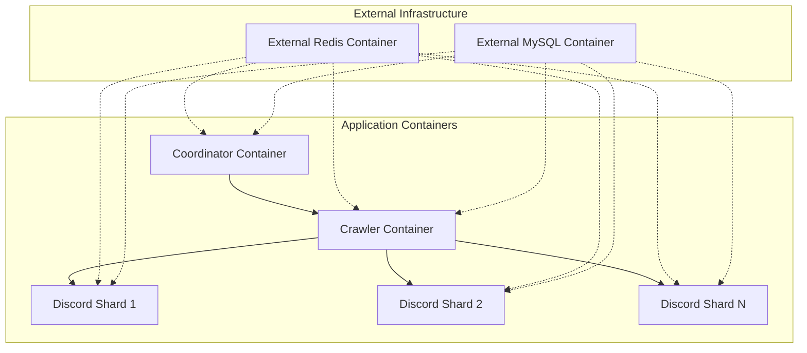

````markdown
# Story 4.1: Dock  - [ ] 建立統一的 Docker Compose 配置
   - 建立 `docker-compose.yml` 主要配置檔案
   - 支援服務依賴關係和啟動順序
   - 支援外部 Redis 和 MySQL 服務連接
   - 支援 Coordinator 對 Docker socket 的存取以實現動態 Shard 縮放器化基礎設施建立

## Status
Draft

## Story
**As a** 系統管理員和開發者,
**I want** 將整個 Discord Stream Notify Bot 系統 (Coordinator、Crawler、Discord Shard) 容器化並支援 Docker Compose 管理,
**so that** 能夠以標準化的容器方式快速部署、縮放和管理整個分散式系統，簡化開發環境建置和生產部署流程

## Acceptance Criteria

1. [ ] 建立 Coordinator 服務的 Docker 容器
   - 建立 `StreamNotifyBot.Coordinator/Dockerfile`
   - 支援 gRPC 服務暴露和健康檢查
   - 包含進程管理和監控功能
   - 支援 Prometheus 指標暴露

2. [ ] 建立 Crawler 服務的 Docker 容器
   - 建立 `StreamNotifyBot.Crawler/Dockerfile`
   - 支援所有平台 API 整合
   - 包含會員驗證和事件廣播功能
   - 支援健康檢查端點

3. [ ] 建立 Discord Shard 的 Docker 容器
   - 建立 `DiscordStreamNotifyBot/Dockerfile`
   - 支援動態 Shard 參數傳遞
   - 包含事件監聽和指令處理功能
   - 支援優雅關閉機制

4. [ ] 建立統一的 Docker Compose 配置
   - 建立 `docker-compose.yml` 主要配置檔案
   - 支援服務依賴關係和啟動順序
   - 支援外部 Redis 和 MySQL 服務連接

5. [ ] 實作容器間網路和服務發現
   - 配置 Docker 內部網路
   - 設定服務間通訊端點
   - 實作環境變數配置管理
   - 支援動態服務發現

6. [ ] 建立容器編排和管理工具
   - 建立 `scripts/docker-start.sh` 啟動腳本
   - 建立 `scripts/docker-stop.sh` 停止腳本
   - 建立 `scripts/docker-logs.sh` 日誌查看腳本
   - 支援生產環境部署

## Tasks / Subtasks

- [ ] Task 1: 建立 Coordinator 服務容器化 (AC: 1)
  - [ ] 建立 `StreamNotifyBot.Coordinator/Dockerfile`：
    ```dockerfile
    FROM mcr.microsoft.com/dotnet/aspnet:8.0
    WORKDIR /app
    COPY bin/Release/net8.0/publish/ .
    EXPOSE 6110 6112
    HEALTHCHECK --interval=30s --timeout=10s --retries=3 \
      CMD curl -f http://localhost:6112/health || exit 1
    ENTRYPOINT ["dotnet", "StreamNotifyBot.Coordinator.dll"]
    ```
  - [ ] 修改 `Program.cs` 支援容器環境變數配置
  - [ ] 實作 gRPC 和 HTTP 雙端口綁定 (6110: gRPC, 6112: Metrics/Health)
  - [ ] 配置結構化日誌輸出至 stdout 以支援 Docker 日誌收集
  - [ ] 建立 `.dockerignore` 檔案排除不必要的建置內容

- [ ] Task 2: 建立 Crawler 服務容器化 (AC: 2)
  - [ ] 建立 `StreamNotifyBot.Crawler/Dockerfile`：
    ```dockerfile
    FROM mcr.microsoft.com/dotnet/aspnet:8.0
    WORKDIR /app
    COPY bin/Release/net8.0/publish/ .
    EXPOSE 6111
    HEALTHCHECK --interval=30s --timeout=10s --retries=3 \
      CMD curl -f http://localhost:6111/health || exit 1
    ENTRYPOINT ["dotnet", "StreamNotifyBot.Crawler.dll"]
    ```
  - [ ] 配置所有外部 API 整合的環境變數支援：
    - `YOUTUBE_API_KEYS` (逗號分隔多個金鑰)
    - `TWITCH_CLIENT_ID`, `TWITCH_CLIENT_SECRET`
    - `TWITTER_COOKIES`, `TWITCASTING_API_KEY`
  - [ ] 實作 Redis 和資料庫連線的容器環境配置
  - [ ] 建立健康檢查端點 `/health` 回報爬蟲狀態
  - [ ] 支援 Webhook 接收端點的容器網路配置

- [ ] Task 3: 建立 Discord Shard 容器化 (AC: 3)
  - [ ] 建立 `DiscordStreamNotifyBot/Dockerfile`：
    ```dockerfile
    FROM mcr.microsoft.com/dotnet/aspnet:8.0
    WORKDIR /app
    COPY bin/Release/net8.0/publish/ .
    ENTRYPOINT ["dotnet", "DiscordStreamNotifyBot.dll"]
    ```
  - [ ] 修改 `Program.cs` 支援從環境變數讀取 Shard 參數：
    - `SHARD_ID` - 目前 Shard ID
    - `TOTAL_SHARDS` - 總 Shard 數量
    - `DISCORD_TOKEN` - Bot Token
  - [ ] 實作 Discord Shard 的健康檢查邏輯 (連接狀態回報)
  - [ ] 配置優雅關閉處理 (SIGTERM 信號處理)
  - [ ] 建立事件監聽和 gRPC 通訊的容器環境配置

- [ ] Task 4: 建立 Docker Compose 主配置 (AC: 4)
  - [ ] 建立 `docker-compose.yml` 包含所有服務定義：
    ```yaml
    services:
      coordinator:
        build:
          context: .
          dockerfile: StreamNotifyBot.Coordinator/Dockerfile
        ports:
          - "6110:6110"  # gRPC
          - "6112:6112"  # HTTP Metrics/Health
        environment:
          - REDIS_CONNECTION=${REDIS_CONNECTION:-redis:6379}
          - DATABASE_CONNECTION=${DATABASE_CONNECTION}
          - DISCORD_TOKEN=${DISCORD_TOKEN}
        volumes:
          - /var/run/docker.sock:/var/run/docker.sock  # 允許動態 Shard 縮放
        restart: unless-stopped

      crawler:
        build:
          context: .
          dockerfile: StreamNotifyBot.Crawler/Dockerfile
        ports:
          - "6111:6111"  # Health Check
        environment:
          - REDIS_CONNECTION=${REDIS_CONNECTION:-redis:6379}
          - DATABASE_CONNECTION=${DATABASE_CONNECTION}
          - COORDINATOR_GRPC_ENDPOINT=coordinator:6110
          - YOUTUBE_API_KEYS=${YOUTUBE_API_KEYS}
          - TWITCH_CLIENT_ID=${TWITCH_CLIENT_ID}
          - TWITCH_CLIENT_SECRET=${TWITCH_CLIENT_SECRET}
        depends_on:
          - coordinator
        restart: unless-stopped

      discord-shard:
        build:
          context: .
          dockerfile: DiscordStreamNotifyBot/Dockerfile
        environment:
          - REDIS_CONNECTION=${REDIS_CONNECTION:-redis:6379}
          - DATABASE_CONNECTION=${DATABASE_CONNECTION}
          - COORDINATOR_GRPC_ENDPOINT=coordinator:6110
          - DISCORD_TOKEN=${DISCORD_TOKEN}
          - SHARD_ID=${SHARD_ID:-0}
          - TOTAL_SHARDS=${TOTAL_SHARDS:-1}
        depends_on:
          - crawler
        restart: unless-stopped

    networks:
      default:
        name: ${NETWORK_NAME:-streamnotify-network}
        external: true
    ```

  - [ ] 建立 `.env` 範本檔案包含所有必要環境變數：
    ```bash
    # .env.example
    # 外部 Redis 和 MySQL 連接設定
    REDIS_CONNECTION=redis-host:6379
    DATABASE_CONNECTION=Server=mysql-host;Database=streamnotify;Uid=streamnotify;Pwd=password123;

    # Discord 和 API 設定
    DISCORD_TOKEN=your_discord_bot_token
    YOUTUBE_API_KEYS=key1,key2,key3
    TWITCH_CLIENT_ID=your_twitch_client_id
    TWITCH_CLIENT_SECRET=your_twitch_client_secret
    TWITTER_COOKIES=your_twitter_cookies
    TWITCASTING_API_KEY=your_twitcasting_api_key

    # Docker 網路設定
    NETWORK_NAME=streamnotify-network
    TOTAL_SHARDS=3
    SHARD_ID=0

    # 外部服務主機設定 (用於連線測試)
    REDIS_HOST=redis-host
    REDIS_PORT=6379
    MYSQL_HOST=mysql-host
    MYSQL_PORT=3306
    MYSQL_USER=streamnotify
    MYSQL_PASSWORD=password123
    ```
  - [ ] 配置外部網路連接以支援 Redis 和 MySQL 服務
  - [ ] 實作 Docker 網路配置以支援服務間通訊

- [ ] Task 5: 實作 Discord Gateway 建議的動態 Shard 縮放 (AC: 4, 5)
  - [ ] 在 Coordinator 中實作 Discord Gateway Shard 推薦數量檢查：
    ```csharp
    // StreamNotifyBot.Coordinator/Services/ShardManager.cs
    public class ShardManager
    {
        public async Task<int> GetRecommendedShardCountAsync()
        {
            using var client = new HttpClient();
            client.DefaultRequestHeaders.Authorization = 
                new("Bot", Environment.GetEnvironmentVariable("DISCORD_TOKEN"));
            
            var response = await client.GetAsync("https://discord.com/api/v10/gateway/bot");
            var content = await response.Content.ReadAsStringAsync();
            var gatewayInfo = JsonSerializer.Deserialize<GatewayBotInfo>(content);
            
            return gatewayInfo.Shards;
        }
        
        public async Task ScaleDockerShardServicesAsync(int targetShardCount)
        {
            // 使用 Docker API 或執行 docker-compose 命令
            var currentShardCount = await GetCurrentShardCountAsync();
            
            if (currentShardCount != targetShardCount)
            {
                await ExecuteDockerComposeScaleAsync(targetShardCount);
            }
        }
    }
    ```
  - [ ] 建立 Docker API 整合以支援容器內部縮放操作：
    ```csharp
    // 掛載 Docker socket 以允許容器操作 Docker
    // docker-compose.yml 中的 Coordinator 服務需要掛載 Docker socket
    volumes:
      - /var/run/docker.sock:/var/run/docker.sock
    ```
  - [ ] 實作 Coordinator 啟動時的自動 Shard 數量檢查和調整
  - [ ] 建立定期檢查機制 (每小時檢查 Discord Gateway 建議)
  - [ ] 實作 Shard 縮放的通知和日誌記錄

- [ ] Task 6: 建立容器管理腳本工具 (AC: 6)
  - [ ] 建立 `scripts/docker-start.sh` 統一啟動腳本：
    ```bash
    #!/bin/bash
    set -e

    echo "Starting Discord Stream Notify Bot services..."

    # 檢查 .env 檔案
    if [ ! -f .env ]; then
        echo "Creating .env from template..."
        cp .env.example .env
        echo "Please edit .env file and restart"
        exit 1
    fi

    # 檢查外部網路是否存在
    NETWORK_NAME=${NETWORK_NAME:-streamnotify-network}
    if ! docker network ls | grep -q $NETWORK_NAME; then
        echo "Creating Docker network: $NETWORK_NAME"
        docker network create $NETWORK_NAME
    fi

    # 建置所有容器
    docker-compose build

    # 啟動應用服務
    echo "Starting application services..."
    docker-compose up -d coordinator crawler

    # 等待 Coordinator 和 Crawler 就緒
    echo "Waiting for Coordinator and Crawler..."
    while ! curl -f http://localhost:6112/health > /dev/null 2>&1; do
        echo "Waiting for Coordinator health check..."
        sleep 5
    done

    while ! curl -f http://localhost:6111/health > /dev/null 2>&1; do
        echo "Waiting for Crawler health check..."
        sleep 5
    done

    # 啟動 Discord Shard
    echo "Starting Discord Shard services..."
    docker-compose up -d discord-shard

    echo "All services started successfully!"
    docker-compose ps
    ```

  - [ ] 建立 `scripts/docker-stop.sh` 優雅停止腳本：
    ```bash
    #!/bin/bash
    set -e

    echo "Stopping Discord Stream Notify Bot services..."

    # 優雅停止 Discord Shard
    echo "Stopping Discord Shard services..."
    docker-compose stop discord-shard

    # 停止應用服務
    echo "Stopping application services..."
    docker-compose stop crawler coordinator

    echo "All services stopped successfully!"
    ```

  - [ ] 建立 `scripts/docker-logs.sh` 日誌查看腳本：
    ```bash
    #!/bin/bash

    SERVICE=${1:-all}

    if [ "$SERVICE" = "all" ]; then
        docker-compose logs -f
    else
        docker-compose logs -f $SERVICE
    fi
    ```

  - [ ] 建立 `scripts/docker-scale.sh` 智慧型 Shard 縮放腳本：
    ```bash
    #!/bin/bash

    # 自動檢查 Discord Gateway 建議的 Shard 數量並縮放
    AUTO_SCALE=${1:-false}

    if [ "$AUTO_SCALE" = "auto" ]; then
        echo "Checking Discord Gateway recommended shard count..."
        
        # 透過 Coordinator 的 API 端點取得建議的 Shard 數量
        RECOMMENDED_SHARDS=$(curl -s http://localhost:6112/api/recommended-shard-count)
        
        if [ -z "$RECOMMENDED_SHARDS" ] || [ "$RECOMMENDED_SHARDS" -eq 0 ]; then
            echo "Failed to get recommended shard count, using default: 1"
            RECOMMENDED_SHARDS=1
        fi
        
        SHARD_COUNT=$RECOMMENDED_SHARDS
    else
        SHARD_COUNT=${1:-3}
    fi

    echo "Scaling Discord Shard to $SHARD_COUNT instances..."

    # 更新環境變數
    export TOTAL_SHARDS=$SHARD_COUNT

    # 縮放服務
    docker-compose up -d --scale discord-shard=$SHARD_COUNT

    echo "Scaled to $SHARD_COUNT shards successfully!"
    docker-compose ps discord-shard
    ```

- [ ] Task 7: 建立多階段建置的 Dockerfile 優化 (AC: 1, 2, 3)
  - [ ] 建立多階段建置 Dockerfile 範本：
    ```dockerfile
    # Build stage
    FROM mcr.microsoft.com/dotnet/sdk:8.0 AS build
    WORKDIR /src

    # 複製專案檔案
    COPY ["StreamNotifyBot.Coordinator/StreamNotifyBot.Coordinator.csproj", "StreamNotifyBot.Coordinator/"]
    COPY ["StreamNotifyBot.Crawler/StreamNotifyBot.Crawler.csproj", "StreamNotifyBot.Crawler/"]
    COPY ["DiscordStreamNotifyBot/DiscordStreamNotifyBot.csproj", "DiscordStreamNotifyBot/"]

    # 還原 NuGet 套件
    RUN dotnet restore "StreamNotifyBot.Coordinator/StreamNotifyBot.Coordinator.csproj"

    # 複製所有原始碼
    COPY . .

    # 建置專案
    WORKDIR "/src/StreamNotifyBot.Coordinator"
    RUN dotnet build "StreamNotifyBot.Coordinator.csproj" -c Release -o /app/build

    # Publish stage
    FROM build AS publish
    RUN dotnet publish "StreamNotifyBot.Coordinator.csproj" -c Release -o /app/publish

    # Runtime stage
    FROM mcr.microsoft.com/dotnet/aspnet:8.0 AS runtime
    WORKDIR /app
    
    # 安裝健康檢查工具
    RUN apt-get update && apt-get install -y curl && rm -rf /var/lib/apt/lists/*
    
    COPY --from=publish /app/publish .
    
    # 建立非 root 使用者
    RUN groupadd -r appuser && useradd -r -g appuser appuser
    RUN chown -R appuser:appuser /app
    USER appuser
    
    EXPOSE 6110 6112
    HEALTHCHECK --interval=30s --timeout=10s --retries=3 \
        CMD curl -f http://localhost:6112/health || exit 1
    
    ENTRYPOINT ["dotnet", "StreamNotifyBot.Coordinator.dll"]
    ```
  - [ ] 實作建置快取優化，優先複製 `.csproj` 檔案
  - [ ] 配置 `.dockerignore` 排除不必要檔案提升建置速度
  - [ ] 支援開發和生產環境的不同建置目標

- [ ] Task 8: 實作容器網路安全和監控 (AC: 5)
  - [ ] 建立 Docker 自定義網路配置：
    ```yaml
    networks:
      streamnotify-network:
        driver: bridge
        ipam:
          driver: default
          config:
            - subnet: 172.20.0.0/16
    ```
  - [ ] 配置服務間通訊加密 (TLS for gRPC)
  - [ ] 實作容器秘密管理 (Docker Secrets 或 環境變數加密)
  - [ ] 建立容器資源限制配置 (CPU/記憶體限制)
  - [ ] 整合 Docker 日誌驅動程式 (JSON file, syslog)

- [ ] Task 9: 建立外部服務連接和驗證工具 (AC: 5)
  - [ ] 建立外部 Redis 和 MySQL 連接驗證腳本
  - [ ] 實作網路連通性測試工具
  - [ ] 建立 `scripts/check-external-services.sh` 外部服務檢查腳本：
    ```bash
    #!/bin/bash
    set -e
    
    echo "Checking external services connectivity..."
    
    # 檢查 Redis 連線
    if ! redis-cli -h ${REDIS_HOST:-redis} -p ${REDIS_PORT:-6379} ping; then
        echo "✗ Redis connection failed"
        exit 1
    fi
    echo "✓ Redis connection successful"
    
    # 檢查 MySQL 連線
    if ! mysqladmin ping -h ${MYSQL_HOST:-mysql} -P ${MYSQL_PORT:-3306} -u ${MYSQL_USER} -p${MYSQL_PASSWORD}; then
        echo "✗ MySQL connection failed"
        exit 1
    fi
    echo "✓ MySQL connection successful"
    
    echo "All external services are accessible!"
    ```
  - [ ] 建立環境變數驗證和預設值處理
  - [ ] 實作容器啟動前的連線測試機制

- [ ] Task 10: 建立測試和驗證工具 (AC: 1-6)
  - [ ] 建立 `docker-compose.test.yml` 測試環境配置
  - [ ] 實作容器健康檢查驗證腳本
  - [ ] 建立容器間通訊測試工具
  - [ ] 實作負載測試容器配置
  - [ ] 建立自動化部署驗證流程

## Dev Notes

### Docker 容器化架構設計

基於現有的 Coordinator-Shard 分散式架構，將整個系統容器化以簡化部署和管理。

**容器化優勢**：
- **標準化部署**：統一的容器環境，消除環境差異
- **快速擴縮容**：支援動態 Shard 數量調整
- **隔離性增強**：各服務獨立運行，故障影響範圍縮小
- **資源管控**：精確控制各服務的 CPU 和記憶體使用
- **簡化運維**：使用 Docker Compose 一鍵啟停整個系統

### 核心架構組件

**1. Coordinator 容器**
- **基底映像**: `mcr.microsoft.com/dotnet/aspnet:8.0`
- **暴露端口**: 6110 (gRPC), 6112 (HTTP Health/Metrics/API)
- **核心功能**: 進程管理、健康檢查、Prometheus 指標、Discord Gateway 整合、動態 Shard 縮放
- **特殊權限**: 掛載 Docker socket 以支援容器內部縮放操作
- **依賴服務**: 外部 Redis, 外部 MySQL

**2. Crawler 容器**
- **基底映像**: `mcr.microsoft.com/dotnet/aspnet:8.0`
- **暴露端口**: 6111 (Health Check)
- **核心功能**: 平台爬蟲、會員驗證、事件廣播
- **外部整合**: YouTube API, Twitch API, Twitter API, TwitCasting API
- **依賴服務**: Coordinator, 外部 Redis, 外部 MySQL

**3. Discord Shard 容器**
- **基底映像**: `mcr.microsoft.com/dotnet/aspnet:8.0`
- **核心功能**: Discord 指令處理、事件監聽、通知發送
- **動態配置**: 支援環境變數傳遞 Shard ID 和總數
- **依賴服務**: Crawler, 外部 Redis, 外部 MySQL

**4. 基礎設施容器 (外部)**
- **Redis**: 獨立的外部 Redis 容器 - PubSub 通訊和快取
- **MySQL**: 獨立的外部 MySQL/MariaDB 容器 - 資料庫服務

### 服務間通訊配置

**Docker 內部網路**：
```yaml
networks:
  streamnotify-network:
    driver: bridge
    ipam:
      config:
        - subnet: 172.20.0.0/16
```

**服務發現配置**：
- Coordinator gRPC 端點: `coordinator:6110`
- Redis 連接: 透過環境變數 `REDIS_CONNECTION` 配置外部 Redis
- MySQL 連接: 透過環境變數 `DATABASE_CONNECTION` 配置外部 MySQL
- Crawler Health: `crawler:6111`

**環境變數管理**：
```bash
# .env 檔案範例
# 外部 Redis 和 MySQL 連接設定
REDIS_CONNECTION=redis-host:6379
DATABASE_CONNECTION=Server=mysql-host;Database=streamnotify;Uid=streamnotify;Pwd=password123;

# Discord 和 API 設定
DISCORD_TOKEN=your_discord_bot_token
YOUTUBE_API_KEYS=key1,key2,key3
TWITCH_CLIENT_ID=your_twitch_client_id
TWITCH_CLIENT_SECRET=your_twitch_client_secret

# Docker 網路設定
NETWORK_NAME=streamnotify-network
TOTAL_SHARDS=3
```

### Docker Compose 服務依賴關係



### 動態 Shard 縮放實作

**Discord Gateway 整合**：
```csharp
// Coordinator 中的 Discord Gateway 整合
public class DiscordGatewayService
{
    public async Task<int> GetRecommendedShardCountAsync()
    {
        using var client = new HttpClient();
        client.DefaultRequestHeaders.Authorization = 
            new("Bot", Environment.GetEnvironmentVariable("DISCORD_TOKEN"));
        
        var response = await client.GetAsync("https://discord.com/api/v10/gateway/bot");
        var botGateway = await response.Content.ReadFromJsonAsync<BotGatewayResponse>();
        
        return botGateway.Shards;
    }
}

public class ShardScalingService
{
    public async Task ScaleToRecommendedShardCountAsync()
    {
        var recommendedCount = await _gatewayService.GetRecommendedShardCountAsync();
        var currentCount = await GetCurrentShardCountAsync();
        
        if (recommendedCount != currentCount)
        {
            await ExecuteDockerComposeScaleAsync(recommendedCount);
            _logger.LogInformation("Scaled shards from {CurrentCount} to {RecommendedCount}", 
                currentCount, recommendedCount);
        }
    }
}
```

**自動縮放觸發機制**：
```bash
# 智慧型自動縮放
./scripts/docker-scale.sh auto

# 手動指定數量 (傳統方式)
./scripts/docker-scale.sh 5
```

**Docker Socket 存取安全性**：
- 僅 Coordinator 容器需要 Docker socket 存取
- 使用最小權限原則，只允許執行 docker-compose scale 操作
- 定期檢查機制 (每小時) 避免頻繁 API 呼叫

**Shard ID 動態分配**：
```csharp
// 在 Discord Shard 容器中
public class Program
{
    public static async Task Main(string[] args)
    {
        // 支援多種 Shard ID 來源
        var shardId = GetShardId();
        var totalShards = GetTotalShards();
        
        await RunBotAsync(shardId, totalShards);
    }
    
    private static int GetShardId()
    {
        // 1. 命令列參數 (傳統方式)
        if (args.Length > 0 && int.TryParse(args[0], out var cmdShardId))
            return cmdShardId;
            
        // 2. 環境變數
        if (int.TryParse(Environment.GetEnvironmentVariable("SHARD_ID"), out var envShardId))
            return envShardId;
            
        // 3. 容器 hostname 解析 (適用於 Docker Compose scale)
        var hostname = Environment.MachineName; // discord-shard_2
        if (hostname.Contains("_"))
        {
            var parts = hostname.Split('_');
            if (int.TryParse(parts[^1], out var hostnameShardId))
                return hostnameShardId - 1; // Docker Compose scale 從 1 開始
        }
        
        return 0; // 預設值
    }
}
```

### 建置和部署流程優化

**多階段 Dockerfile 建置**：
1. **Build Stage**: 使用 `dotnet/sdk:8.0` 進行編譯
2. **Publish Stage**: 建立發布版本
3. **Development Stage**: 支援開發時熱重載
4. **Runtime Stage**: 最小化執行時映像

**建置快取優化策略**：
1. 先複製 `.csproj` 檔案並還原 NuGet 套件
2. 再複製原始碼進行建置
3. 利用 Docker Layer 快取加速重複建置

**安全性考量**：
- 使用非 root 使用者執行容器
- 設定適當的檔案權限
- 限制容器資源使用 (CPU/Memory)
- 配置網路隔離和防火牆規則

### 監控和日誌管理

**健康檢查整合**：
- Coordinator: `/health` 端點檢查所有託管服務狀態
- Crawler: `/health` 端點檢查爬蟲和 API 連接狀態
- Discord Shard: gRPC 心跳檢查 Discord 連接狀態
- 外部基礎設施: 需要在各服務的健康檢查中驗證 Redis 和 MySQL 連線

**日誌收集策略**：
- 所有應用程式輸出至 `stdout/stderr`
- 使用結構化日誌格式 (JSON)
- Docker 自動收集並可透過 `docker-compose logs` 查看
- 支援外部日誌系統整合 (ELK Stack, Fluentd)

**Prometheus 指標暴露**：
- Coordinator 在 6112 端口暴露 `/metrics`
- 支援 Docker 容器資源指標收集
- 整合 cAdvisor 容器監控

### 開發工作流程

**快速啟動**：
```bash
# 1. 複製環境變數範本
cp .env.example .env

# 2. 編輯必要配置 (包含外部 Redis 和 MySQL 連接資訊)
nano .env

# 3. 確保外部網路存在
docker network create streamnotify-network 2>/dev/null || true

# 4. 啟動應用服務
docker-compose up -d

# 5. 查看服務狀態
docker-compose ps

# 6. 查看即時日誌
docker-compose logs -f
```

**生產環境部署**：
```bash
# 1. 建置生產映像
docker-compose build

# 2. 啟動生產環境
docker-compose up -d

# 3. 驗證部署
./scripts/check-external-services.sh
```

### 測試策略

**容器測試要求**：
- 各容器獨立建置和啟動測試
- 服務間通訊驗證測試
- 健康檢查端點功能測試
- 動態縮放功能驗證測試

**整合測試環境**：
```yaml
# docker-compose.test.yml
version: '3.8'
services:
  # 應用程式測試容器
  app-test:
    build:
      context: .
      target: development
    command: ["dotnet", "test", "--logger", "console"]
    environment:
      - DATABASE_CONNECTION=${TEST_DATABASE_CONNECTION}
      - REDIS_CONNECTION=${TEST_REDIS_CONNECTION}
    networks:
      - ${TEST_NETWORK_NAME:-streamnotify-test-network}

networks:
  streamnotify-test-network:
    external: true
```

### 故障排除和除錯

**常見問題解決**：
1. **容器啟動失敗**: 檢查 `docker-compose logs <service>` 查看錯誤訊息
2. **服務間通訊失敗**: 驗證 Docker 網路配置和服務名稱
3. **環境變數未載入**: 確認 `.env` 檔案存在且格式正確
4. **健康檢查失敗**: 檢查應用程式健康檢查端點是否正常回應
5. **外部服務連線問題**: 
   - 確認外部 Redis 和 MySQL 容器正常運行
   - 檢查網路連通性和防火牆設定
   - 驗證 `REDIS_CONNECTION` 和 `DATABASE_CONNECTION` 環境變數正確性
   - 使用 `scripts/check-external-services.sh` 驗證連線

**除錯工具**：
```bash
# 進入容器除錯
docker-compose exec coordinator bash

# 檢查容器網路
docker network inspect <network_name>

# 查看容器資源使用
docker stats

# 檢查容器映像層
docker history <image_name>
```

## Testing

**測試覆蓋範圍**：
- Dockerfile 建置成功性測試
- Docker Compose 服務啟動順序測試
- 容器健康檢查功能測試
- 服務間通訊連接測試
- 環境變數配置載入測試
- 動態 Shard 縮放功能測試

**自動化測試腳本**：
```bash
#!/bin/bash
# tests/docker-integration-test.sh

echo "Testing Docker containerization..."

# 建置所有映像
docker-compose build

# 啟動測試環境
docker-compose -f docker-compose.test.yml up -d

# 等待服務就緒
sleep 30

# 測試健康檢查
if curl -f http://localhost:6112/health; then
    echo "✓ Coordinator health check passed"
else
    echo "✗ Coordinator health check failed"
    exit 1
fi

if curl -f http://localhost:6111/health; then
    echo "✓ Crawler health check passed"
else
    echo "✗ Crawler health check failed"
    exit 1
fi

# 測試服務間通訊
# ... 更多測試

echo "All Docker tests passed!"
```

**效能測試**：
- 容器啟動時間測試
- 資源使用效率對比測試 (容器 vs 原生)
- 多 Shard 併發測試
- 長時間運行穩定性測試

## Change Log

| Date | Version | Description | Author |
|------|---------|-------------|---------|
| 2025-08-18 | 1.0 | Story 初始建立，Docker 容器化基礎設施 | Scrum Master |

## Dev Agent Record

_此區段由開發代理在實作期間填寫_

### Agent Model Used

_待開發代理填寫_

### Debug Log References

_待開發代理填寫_

### Completion Notes List

_待開發代理填寫_

### File List

_待開發代理填寫_

## QA Results

_此區段由 QA 代理在完成故事實作的 QA 審查後填寫_

````
